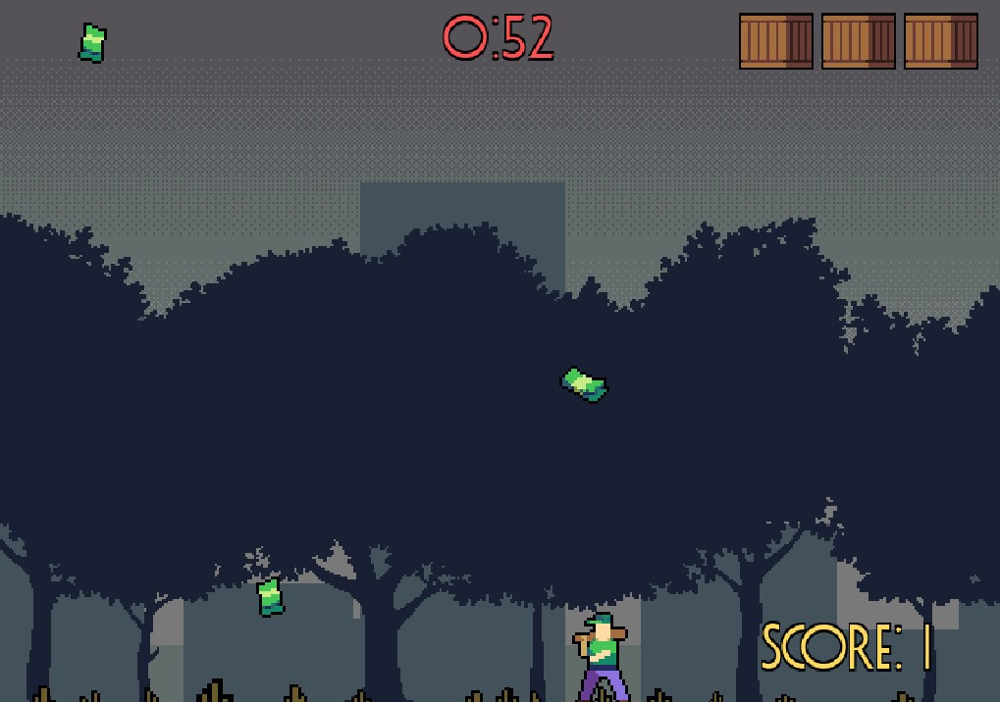

# CppParachute
## C++ GDNative Integration with GODOT Engine

## Prerequisites
Node.js  
Visual Studio Build Tools for C++ 2019/2022 (within Visual Studio Installer) 
C++/CLI support for v143 build tools (x86) 
C++ Modules for v143 build tools  
MSVC v142 - VS 2019 C++   
Notepad++  
<a href='https://godotengine.org/download/windows' target='_blank' >GODOT Engine v3.4.3 (Standard version, 64-bit) </a>  
<a href='https://scons.org/' target='_blank' >Scons</a>  
<a href='https://github.com/godotengine/godot-cpp' target='_blank'>godot-cpp</a> 

## The Specific Commands
1) CMD: (Run as Administrator) x86 Native Tools Command Prompt for VS 2022
2) <pre>mkdir gdnative_cpp_example  cd gdnative_cpp_example</pre>
3) <pre>git clone --recursive -b 3.x https://github.com/godotengine/godot-cpp </pre>
4) <pre>cd godot-cpp  scons platform=windows generate_bindings=yes -j4 </pre>

--- Now you're ready to develop in C++ ---

## All commands are done within 'x86 Native Tools Command Prompt for VS 2022'

# NOTES:
I had a lot of confusion during this, due to the vast lack of resources/info I could find online regarding GDNative C++.  
This was one of the most frustrating workflows I've had to deal with, especially if you've never done this, I will save you the migraine: 
- The CMD tool you're using, has a huge impact on the project setup. I suggest using a command prompt with internal references to CL.exe, hence why I'm using the Visual Studio CMD
- In the <a href='https://github.com/godotengine/godot-cpp' target='_blank'>godot-cpp repo</a>, the 'demo' folder is renamed to 'test'. It took some time out of development to figure out, literally. It is functionally the same.
- DON'T MAKE A NEW GODOT PROJECT. Import the test/project.godot file.
- The SConstruct file in the root folder (godot-cpp) is only used for the setup, and the test/SConstruct is used to <b>actually compile your code</b>
- The overall structure of how the project should look, is barely specified. But the godot-cpp is the root, and godot-headers holds all the references to other libraries.

## Sources
https://github.com/godotengine/gdnative-demos/tree/master/cpp/dodge_the_creeps  
https://docs.godotengine.org/en/3.4/tutorials/scripting/gdnative/gdnative_cpp_example.html  
https://docs.godotengine.org/en/3.4/tutorials/scripting/gdnative/gdnative_c_example.html  
https://github.com/BastiaanOlij/gdnative_cpp_example  
https://www.youtube.com/watch?v=XPcSfXsoArQ  
https://www.youtube.com/watch?v=gTHDr5Cu6lk  
